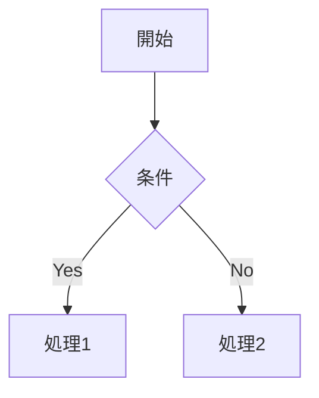
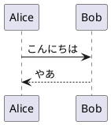

# LocalChat - 完全オフライン社内チャット

外部インターネットに一切接続せず、社内オンプレミス環境（閉域網）で動作する
社内コミュニケーションツールです。OSS公開を前提に、社内固有の
設定はすべて環境変数へ外出ししています。

## 特長（要件対応）

- **完全オフライン**: 外部CDN・クラウドストレージ・Push通知サーバーを一切使用しません。絵文字はUnicode、画面アセットもすべてローカル配信です。
- **リアルタイム通信**: WebSocket による双方向通信。
- **社内サーバー保存**: ファイルはすべて社内サーバーのローカルパスへ保存します。
- **外部依存ゼロ寄り**: パスワードハッシュ（PBKDF2）とトークン署名（HMAC）は Python 標準ライブラリで実装しています。

> 注: ボイスチャンネルは現フェーズでは **非対応** です（要件のフェーズ判断による）。テキストチャンネル・DM・ファイル共有を提供します。

## 技術スタック

| 区分 | 採用技術 |
|------|----------|
| バックエンド | Python 3.11+ / FastAPI |
| リアルタイム | WebSocket（FastAPI/uvicorn） |
| データベース | SQLite（社内ローカル。SQLAlchemy 経由） |
| フロントエンド | バニラ JavaScript / CSS（ビルド不要・外部CDN不使用） |

## 機能一覧

- 認証: ユーザー登録・ログイン（独自DB、パスワードはPBKDF2でハッシュ化）
- **複数アカウント**: 1台の端末で複数アカウントを保持し、ワンクリックで切り替え
- プロフィール: 表示名・アイコン・ステータスメッセージ
- サーバー（ワークスペース）: 作成・一覧
- **招待コード方式の参加**: 管理者/モデレーターがコードを発行し、保有者のみ参加可能（使用回数・有効期限の設定可）
- ロール（権限）管理: 管理者 / モデレーター / 一般ユーザー
- テキストチャンネル: 作成・閲覧
- メッセージ: 送信・編集・削除・**スレッド返信**・**絵文字リアクション**
- **Markdown記法**: 見出し・太字・斜体・取り消し線・コード/コードブロック・引用・リスト・テーブル・リンク（XSS対策済み・依存ライブラリなしの自前実装）
- **図の埋め込み**: Mermaid（ブラウザ内描画）と PlantUML（社内 plantuml.jar による描画、任意設定）
- メンション: `@ユーザー名` による通知
- DM: 1対1 / グループ
- ファイル共有: 画像・PDF・Officeファイル等のアップロード/ダウンロード（社内保存）
- 通知: 未読バッジ、メンション時のデスクトップ通知（ブラウザ標準通知API）

## セットアップ

### 1. 依存パッケージのインストール

```cmd
python -m pip install -r requirements.txt
```

> 閉域網の場合は、事前にホイール（wheel）をダウンロードして社内リポジトリ経由で
> インストールするか、`pip download` でオフラインインストール用のファイルを準備してください。

### 2. 環境変数の設定

```cmd
copy .env.example .env
```

`.env` を開き、最低限 `SECRET_KEY` を推測困難な値へ変更してください。

### 3. 起動

```cmd
python run.py
```

ブラウザで `http://localhost:8000` を開きます。最初の利用者は「新規登録」から
アカウントを作成してください。

## メンバーの招待（招待コード方式）

サーバーへの参加は招待コード方式です。社内の誰でも自由に入れるわけではなく、
コードを知っている人だけが参加できます。

### 招待する側（管理者 / モデレーター）

1. 対象のサーバーを開き、チャンネル一覧上部の **「👤＋（メンバーを招待）」** ボタンを押す
2. 必要に応じて「最大使用回数」「有効期限（分）」を設定し、「招待コードを発行」を押す
3. 発行されたコード（例: `WZ9273UQ`）が自動でクリップボードにコピーされるので、参加してほしい相手に伝える
4. 発行済みコードはこの画面で一覧表示でき、「無効化」でいつでも失効できる

### 招待される側

1. 左端の **「＋（サーバーを追加）」** を押す
2. 「招待コードで参加」欄にコードを入力すると参加先サーバー名が表示される
3. 「参加」を押すと、そのサーバーに `member` として参加する

> 招待発行APIは `admin` / `moderator` のみ実行可能です。直接参加（`/join`）は無効化されています。

## 複数アカウントの利用と切り替え

1台の端末で複数のアカウントを保持し、切り替えて利用できます。

- アカウントを追加: 左下の **⚙（プロフィール設定）** →「別のアカウントを追加」→ ログイン/新規登録
- 切り替え: プロフィール設定内の「アカウントの切り替え」一覧から「切り替え」を押す
- ログアウト: 「このアカウントからログアウト」を押すと、そのアカウントのみ端末から削除され、別のアカウントがあれば自動で切り替わる

> アカウント情報（トークン）は当該端末の `localStorage` に保存されます。共用端末では利用後に各アカウントからログアウトしてください。

## Markdown と図の利用

メッセージは Markdown 記法で装飾できます。対応記法は次のとおりです。

- 見出し（`# 〜 ######`）、太字（`**太字**`）、斜体（`*斜体*`）、取り消し線（`~~取消~~`）
- インラインコード（`` `code` ``）、コードブロック（``` ```lang ... ``` ```）
- 引用（`> 引用`）、箇条書き/番号付きリスト、水平線（`---`）、テーブル（GFM）、リンク（`[表示](URL)`）

すべて外部ライブラリに依存しない自前実装で、HTMLエスケープと `javascript:` 等の危険なURL除去を行っています。

### Mermaid（ブラウザ内で描画）

コードブロックの言語に `mermaid` を指定すると図として描画されます。Mermaid 本体は
`frontend/static/vendor/mermaid.min.js` に同梱しており、外部CDNへは接続しません。

````

````

### PlantUML（サーバー側で描画・任意設定）

コードブロックの言語に `plantuml`（または `puml`）を指定します。PlantUML は Java 製の
`plantuml.jar` が必要なため、社内に配置して `.env` の `PLANTUML_JAR` にパスを設定すると
図として描画されます。未設定の場合はソースコードがそのまま表示されます。

> **Java のバージョン要件**: PlantUML 1.2025 以降は **Java 11 以上**が必要です
> （1.2024 系までは Java 8 で動作）。Java のバージョンが古いと
> `UnsupportedClassVersionError` で描画に失敗します。

`JAVA_BIN` には使用する `java` 実行ファイルを指定します。PATH 上の Java が古い場合は、
管理者権限不要の**ポータブル版 JRE**（zip を展開してパス指定）を使うのが簡単です。

```
# 例: 最新 PlantUML（Java 11+ 必須）＋ 同梱ポータブル JRE 17
PLANTUML_JAR=./plantuml/plantuml-asl-1.2026.6.jar
JAVA_BIN=./runtime/jdk-17.0.19+10-jre/bin/java.exe
```

ポータブル JRE は Eclipse Temurin / Amazon Corretto などの「JRE（zip 版）」を取得し、
任意のフォルダ（例: `runtime/`）へ展開して `bin/java.exe` を `JAVA_BIN` に指定します。
`runtime/` は `.gitignore` 済みのため、各環境で配置してください。

````

````

> PlantUML の描画はサーバー上で `plantuml.jar` を実行します。セキュリティプロファイルを
> SANDBOX に設定して起動しますが、信頼できる社内利用を前提としてください。
> 複雑な図（クラス図等）には別途 Graphviz が必要な場合があります。

## TLS（HTTPS / WSS）

社内LAN内でも暗号化通信を行う要件に対応しています。証明書（PEM形式）を
`.env` に設定すると HTTPS/WSS で起動します。

```
SSL_CERTFILE=./certs/server.crt
SSL_KEYFILE=./certs/server.key
```

設定すると、フロントエンドの WebSocket 接続も自動的に `wss://` を使用します。

### お手軽な方法：自己署名証明書を生成する

社内認証局がない場合は、付属スクリプトで自己署名証明書を生成できます。
`localhost` / `127.0.0.1` に加え、この端末のホスト名・LAN内IPv4 を SAN へ自動登録するため、
他のPCからも WSS で接続できます。

```cmd
python -m pip install cryptography
python scripts/gen_cert.py
```

実行すると `certs/server.crt` と `certs/server.key` が作成されます。
上記のとおり `.env` を設定してサーバーを再起動すると HTTPS/WSS で起動します。

> `cryptography` は証明書の生成にのみ使用します（実行時には不要）。
> `certs/` は秘密鍵を含むため `.gitignore` 済みです。各環境で生成してください。

### 証明書の自動生成・自動更新

`.env` で TLS を有効化していれば、**サーバー起動時に証明書を自動管理**します
（既定 `TLS_AUTO_GENERATE=true`）。手動で `gen_cert.py` を実行する必要はありません。

- 証明書が無ければ起動時に自動生成する
- 自己署名証明書の有効期限が近い（既定 `TLS_RENEW_DAYS=30` 日以内）場合は自動で再発行する
- 社内認証局などが発行した**正式な証明書は上書きしない**（期限が近い場合は警告のみ表示）

```
TLS_AUTO_GENERATE=true   # 自動生成・更新の有効/無効
TLS_RENEW_DAYS=30        # この日数以下になったら自己署名証明書を再発行
```

> 証明書の差し替えは起動時に反映されます。稼働中に自動更新が行われた場合は、
> 反映のためサーバーを再起動してください（無停止での切り替えには未対応）。

#### ブラウザの警告について

自己署名証明書のため、初回アクセス時にブラウザが警告を表示します。社内利用では次のいずれかで対応します。

- 警告画面の「詳細設定 → （安全でない）サイトへ移動」で進む
- 生成した `certs/server.crt` を各端末の「信頼されたルート証明機関」に取り込む（警告が出なくなる）
- 社内認証局がある場合は、そこで発行した証明書を `.env` に設定する（最も推奨）

## ディレクトリ構成

```
LocalChat/
├── run.py                  起動スクリプト
├── requirements.txt        依存パッケージ
├── .env.example            環境変数サンプル
├── backend/
│   ├── main.py             FastAPI アプリ本体
│   ├── config.py           環境変数の読み込み
│   ├── database.py         DB接続（SQLite/SQLAlchemy）
│   ├── models.py           ORMモデル
│   ├── schemas.py          入出力スキーマ
│   ├── security.py         パスワードハッシュ・トークン署名
│   ├── deps.py             認証依存性
│   ├── services.py         権限判定・整形などの共通処理
│   ├── ws_manager.py       WebSocket接続管理
│   └── routers/            APIエンドポイント群
│       ├── auth.py / users.py / servers.py
│       ├── invites.py      招待コード発行・参加
│       ├── messages.py / dms.py / files.py / ws.py
│       └── render.py       PlantUML サーバーサイド描画
└── frontend/
    ├── index.html
    └── static/
        ├── css/style.css
        ├── js/app.js
        ├── js/markdown.js  Markdown レンダラ（自前実装）
        └── vendor/mermaid.min.js  Mermaid 本体（ローカル同梱）
```

## データの保存先

- データベース: `./data/localchat.db`（`DATABASE_URL` で変更可）
- アップロードファイル: `./data/uploads/`（`UPLOAD_DIR` で変更可）

社内NAS等へ保存する場合は、これらのパスを共有ストレージのマウント先に設定してください。

## セキュリティ上の注意

- 本番運用前に必ず `SECRET_KEY` を変更してください。
- `.env` および `data/` は `.gitignore` で除外済みです。機密情報をコミットしないでください。
- 社内LAN内であっても、TLS（HTTPS/WSS）の有効化を推奨します。

## 社内ネットワーク限定アクセス（グローバルIP遮断）

要件定義書の「完全閉域網」を担保するため、**社内LAN（プライベートIP）以外からのアクセスを既定で拒否**します。多層防御で構成しています。

1. **アプリ層（既定で有効）**: クライアントIPがプライベート範囲（`10.0.0.0/8`・`172.16.0.0/12`・`192.168.0.0/16`・ループバック・リンクローカル・IPv6 ULA）でない場合、HTTP/WebSocket ともに拒否します（HTTPは403、WSはハンドシェイク前にクローズ）。グローバルIP経由のアクセスを、ネットワーク機器の設定に依存せずアプリ側でも確実に遮断します。
2. **OS層（ファイアウォール）**: `scripts/open_firewall.ps1` は Domain/Private プロファイルのみ許可し、Public（公衆網）では許可しません。
3. **バインド範囲（任意）**: `.env` の `HOST` を `0.0.0.0` ではなく特定の社内IP（例: `192.168.200.221`）にすると、その社内インターフェイスのみで待ち受けます。

```
RESTRICT_TO_PRIVATE=true        # 社内LAN以外を拒否（既定 true）
ALLOWED_CIDRS=                  # 許可ネットワークを限定したい場合に指定（例: 192.168.10.0/24）
TRUST_FORWARDED_FOR=false       # リバースプロキシ配下のときのみ true
```

> リバースプロキシ（nginx等）を経由する場合は、クライアントIPがプロキシのIPになります。
> その際は `TRUST_FORWARDED_FOR=true` にして、プロキシが付与する `X-Forwarded-For` を信頼してください
> （プロキシ自身がプライベートIPであれば既定設定でも通信は可能です）。

## ライセンス

本プロジェクトは [MIT License](LICENSE) のもとで公開しています。
著作権表示および本許諾表示を保持すれば、商用・改変・再配布を含めて自由に利用できます。詳細は同梱の `LICENSE` を参照してください。

Copyright (c) 2026 tkwork
