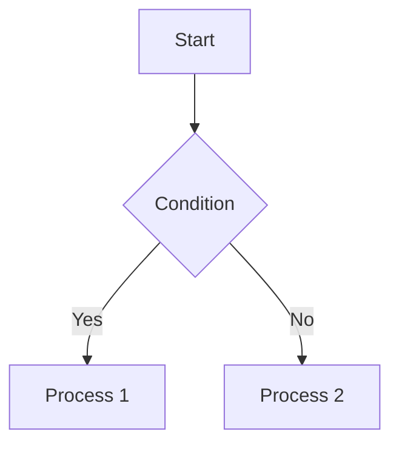

# LocalChat - Fully Offline Internal Chat

[日本語](README.md) | **English**

A self-hosted internal communication tool that operates entirely within an
on-premises environment (closed network) with zero external internet
connectivity. Designed for OSS release — all site-specific settings are
externalized via environment variables.

## Documentation (GitHub Pages)

The basic design document (architecture, class/ER diagrams, sequence diagrams,
flowcharts) is published on GitHub Pages.

📖 **[LocalChat Design Document](https://tkwork-dev.github.io/LocalChat/)**

> Diagrams are rendered offline using Mermaid. You can also open the HTML files under `docs/` locally.

## Key Features

- **Fully offline**: No external CDN, cloud storage, or push notification servers. Emoji via Unicode; all assets served locally.
- **Real-time communication**: Bidirectional messaging over WebSocket.
- **On-premises storage**: All files are saved to a local path on the internal server.
- **Near-zero external dependencies**: Password hashing (PBKDF2) and token signing (HMAC) use Python's standard library only.

> Note: Voice channels are **not supported** in the current phase. Text channels, DMs, and file sharing are provided.

## Tech Stack

| Category | Technology |
|----------|-----------|
| Backend | Python 3.11+ / FastAPI |
| Real-time | WebSocket (FastAPI / uvicorn) |
| Database | SQLite (local, via SQLAlchemy) |
| Frontend | Vanilla JavaScript / CSS (no build step, no CDN) |

## Features

- Authentication: registration & login (own DB, passwords hashed with PBKDF2)
- **Multiple accounts**: hold multiple accounts on one device, switch with one click
- Profile: display name, icon, status message
- Servers (workspaces): create & list
- **Invite-code-based joining**: admins/moderators issue codes; only holders can join (configurable max uses & expiration)
- Role management: admin / moderator / member
- Text channels: create & browse
- Messages: send, edit, delete, **replies** (displayed below the parent message), **emoji reactions**
- **Markdown**: headings, bold, italic, strikethrough, code/code blocks (with filename display support), blockquotes, lists, tables, links (XSS-safe, zero-dependency custom implementation)
- **Embedded diagrams**: Mermaid (client-side) and PlantUML (server-side via `plantuml.jar`, optional)
- Mentions: notify via `@username`
- DMs: 1-on-1 / group
- File sharing: **drag & drop** supported. Upload/download images, PDFs, Office files, etc. (stored on-premises)
- **File preview**: HTML / Markdown / PlantUML files display inline previews in chat (with source toggle & open-in-new-tab). Images show thumbnails as before
- Notifications: unread badges, desktop notifications on mention (browser Notification API)

## Setup

### 1. Install dependencies

```cmd
python -m pip install -r requirements.txt
```

> For air-gapped environments, pre-download wheels with `pip download` and install offline.

### 2. Configure environment variables

```cmd
copy .env.example .env
```

Open `.env` and change at least `SECRET_KEY` to a strong random value.

### 3. Start the server

```cmd
python run.py
```

Open `http://localhost:8000` in your browser. The first user registers via "Sign Up".

## Inviting Members (Invite Code)

Server participation uses invite codes — only those who know the code can join.

### Inviter (admin / moderator)

1. Open the target server and click the **"👤+ (Invite Member)"** button above the channel list
2. Optionally set "Max uses" and "Expiration (minutes)", then click "Generate Invite Code"
3. The generated code (e.g. `WZ9273UQ`) is auto-copied to clipboard — share it with the invitee
4. Issued codes are listed on this screen and can be revoked at any time

### Invitee

1. Click the **"+ (Add Server)"** button on the left
2. Enter the invite code — the target server name will appear
3. Click "Join" to join as a `member`

> Only `admin` / `moderator` roles can issue invites. Direct join (`/join`) is disabled.

## Multiple Accounts

You can hold and switch between multiple accounts on a single device.

- Add account: bottom-left **⚙ (Profile Settings)** → "Add another account" → Login / Register
- Switch: select from the account list in Profile Settings
- Logout: "Log out of this account" removes only that account; if another exists, it auto-switches

> Account tokens are stored in the device's `localStorage`. On shared devices, log out of each account after use.

## Markdown & Diagrams

Messages support Markdown formatting:

- Headings (`# – ######`), bold (`**bold**`), italic (`*italic*`), strikethrough (`~~strike~~`)
- Inline code (`` `code` ``), code blocks (` ```lang ... ``` `)
- **Code block filename display**: Use ` ```ruby:filename.rb ` (language followed by `:filename`) to show the filename above the code block
- Blockquotes (`> quote`), lists (bulleted/numbered), horizontal rule (`---`), tables (GFM), links (`[text](URL)`)

All rendered with a custom zero-dependency implementation with HTML escaping and `javascript:` URL removal.

### Mermaid (client-side rendering)

Specify `mermaid` as the code block language. The Mermaid library is bundled at
`frontend/static/vendor/mermaid.min.js` — no external CDN connection.

````

````

### PlantUML (server-side rendering, optional)

Specify `plantuml` (or `puml`) as the code block language. Requires `plantuml.jar`
(Java). Set the path in `.env` via `PLANTUML_JAR`. If not configured, source code
is displayed as-is.

> **Java version requirement**: PlantUML 1.2025+ requires **Java 11 or later**.

```
PLANTUML_JAR=./plantuml/plantuml-asl-1.2026.6.jar
JAVA_BIN=./runtime/jdk-17.0.19+10-jre/bin/java.exe
```

> Portable JRE (Eclipse Temurin / Amazon Corretto zip) can be extracted to `runtime/` and
> referenced via `JAVA_BIN`. `runtime/` is in `.gitignore` — deploy per environment.

## File Drag & Drop and Preview

Drag and drop files onto the chat area to upload. Inline previews are displayed based on file type:

| File type | Preview |
|---|---|
| Images (png / jpg / gif etc.) | Thumbnail image |
| HTML (.html / .htm) | Rendered via iframe |
| Markdown (.md) | Rendered Markdown → HTML |
| PlantUML (.puml) | Rendered as SVG diagram |
| Others | 📎 link |

All previews include a **`</>` source toggle** button and a **`↗` open in new tab** link.
Preview width is resizable by dragging.

## Timezone Setting

Message timestamps are controlled by `TZ_OFFSET_HOURS` in `.env`.

```
# Offset from UTC in hours. Japan: 9, UTC: 0.
TZ_OFFSET_HOURS=9
```

Default is `9` (JST). Change to the appropriate offset for other regions.

## TLS (HTTPS / WSS)

Set PEM certificate paths in `.env` to enable HTTPS/WSS:

```
SSL_CERTFILE=./certs/server.crt
SSL_KEYFILE=./certs/server.key
```

WebSocket connections automatically use `wss://` when TLS is configured.

### Quick method: self-signed certificate

```cmd
python -m pip install cryptography
python scripts/gen_cert.py
```

This generates `certs/server.crt` and `certs/server.key` with SAN entries for
`localhost`, `127.0.0.1`, the machine's hostname, and LAN IPv4 addresses.

### Auto-generation & auto-renewal

With TLS enabled, certificates are managed automatically at startup
(`TLS_AUTO_GENERATE=true` by default):

- Generated if missing
- Self-signed certs are renewed when expiry is within `TLS_RENEW_DAYS` (default: 30)
- CA-issued certificates are **never overwritten** (warning only)

> `certs/` contains private keys and is in `.gitignore`. Generate per environment.

#### Browser warning

Self-signed certificates trigger browser warnings. Options:

- Proceed via "Advanced → Continue to site"
- Import `certs/server.crt` into each device's trusted root certificate store
- Use a certificate from an internal CA (recommended)

## Directory Structure

```
LocalChat/
├── run.py                  Startup script
├── requirements.txt        Dependencies
├── .env.example            Environment variable sample
├── backend/
│   ├── main.py             FastAPI application
│   ├── config.py           Environment variable loader
│   ├── database.py         DB connection (SQLite/SQLAlchemy)
│   ├── models.py           ORM models
│   ├── schemas.py          I/O schemas
│   ├── security.py         Password hash & token signing
│   ├── deps.py             Auth dependency
│   ├── services.py         Authorization & formatting utilities
│   ├── ws_manager.py       WebSocket connection manager
│   └── routers/            API endpoint routers
│       ├── auth.py / users.py / servers.py
│       ├── invites.py      Invite code issuance & joining
│       ├── messages.py / dms.py / files.py / ws.py
│       └── render.py       PlantUML server-side rendering
└── frontend/
    ├── index.html
    └── static/
        ├── css/style.css
        ├── js/app.js
        ├── js/markdown.js  Markdown renderer (custom)
        └── vendor/mermaid.min.js  Mermaid (bundled locally)
```

## Data Storage

- Database: `./data/localchat.db` (configurable via `DATABASE_URL`)
- Uploaded files: `./data/uploads/` (configurable via `UPLOAD_DIR`)

To store on a NAS, point these paths to the mounted share.

## Security Notes

- Always change `SECRET_KEY` before production use.
- `.env` and `data/` are in `.gitignore`. Never commit secrets.
- Enabling TLS (HTTPS/WSS) is recommended even within the LAN.

## Private Network Guard (Global IP Blocking)

To ensure a fully closed network, **access from non-private IPs is rejected by default**. Defense in depth:

1. **Application layer (enabled by default)**: Rejects clients whose IP is not in private ranges (`10.0.0.0/8`, `172.16.0.0/12`, `192.168.0.0/16`, loopback, link-local, IPv6 ULA). HTTP returns 403; WebSocket closes before handshake.
2. **OS layer (firewall)**: `scripts/open_firewall.ps1` allows only Domain/Private profiles, not Public.
3. **Bind scope (optional)**: Set `HOST` in `.env` to a specific LAN IP instead of `0.0.0.0`.

```
RESTRICT_TO_PRIVATE=true
ALLOWED_CIDRS=
TRUST_FORWARDED_FOR=false
```

> Behind a reverse proxy, set `TRUST_FORWARDED_FOR=true` so the app inspects `X-Forwarded-For`.

## License

This project is released under the [MIT License](LICENSE).
You are free to use, modify, and distribute it, provided the copyright and
permission notice are retained. See `LICENSE` for details.

Copyright (c) 2026 tkwork

## Notice: Telecommunications Business Act (Japan)

This application is designed for **internal use within a closed corporate LAN**. Under such usage, registration or notification under Japan's Telecommunications Business Act is generally not required.

However, if you operate this system in a manner that involves **communication with external third parties** (e.g., providing the service to partner companies, publishing on the internet, or offering it as a SaaS), it **may constitute a telecommunications business** and require prior notification or registration with the Ministry of Internal Affairs and Communications (MIC).

| Usage | Applicability | Procedure |
|-------|--------------|-----------|
| Internal use only (closed corporate LAN) | Likely not applicable | Generally none |
| Provided to affiliates / business partners | May be applicable | Confirm notification requirement |
| Offered to the public as SaaS, etc. | Likely applicable | Registration or notification required |

If you change the deployment to involve external communication, **consult with the relevant Regional Bureau of Telecommunications before starting operation**.

> For detailed legal analysis, see [law.md](law.md) (Japanese). This notice is general information, not legal advice. Consult a legal professional for definitive guidance.
